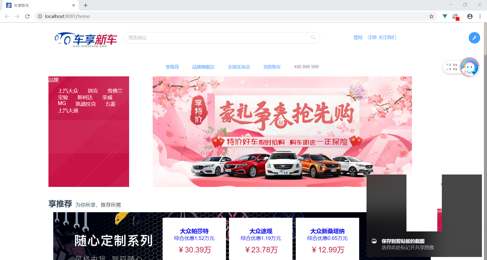
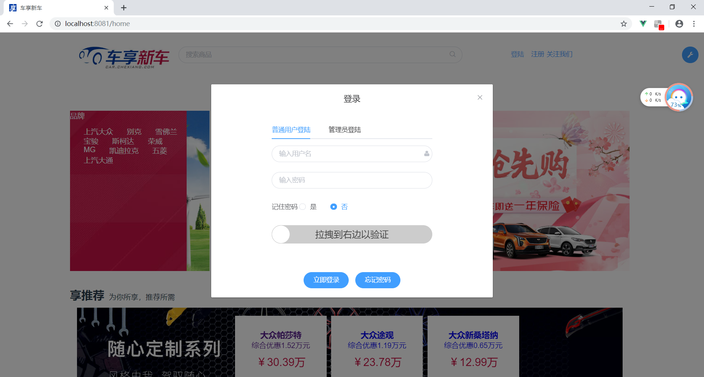
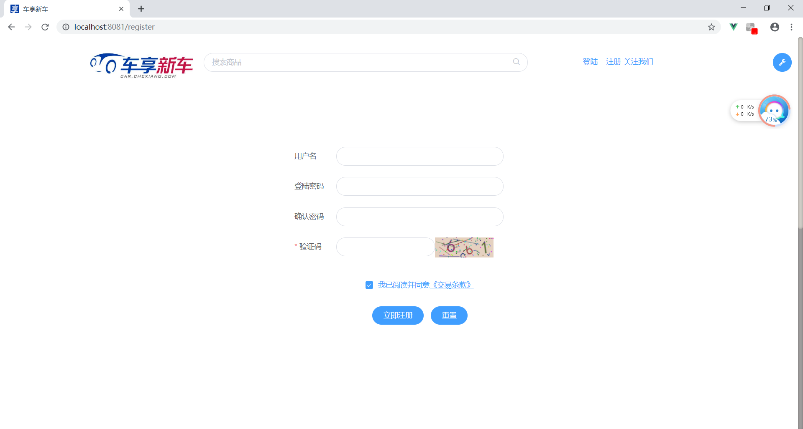
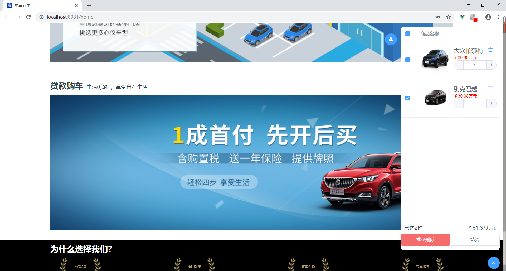
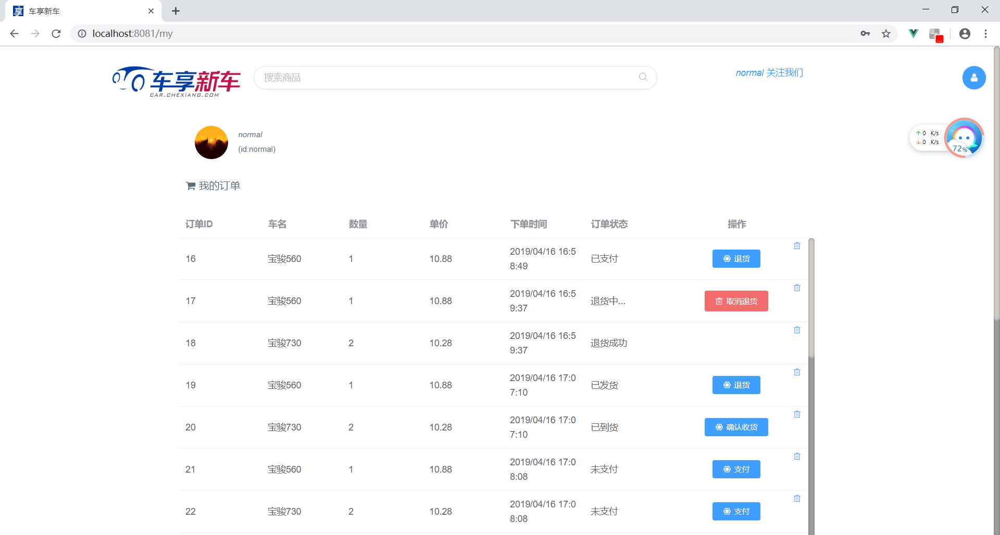
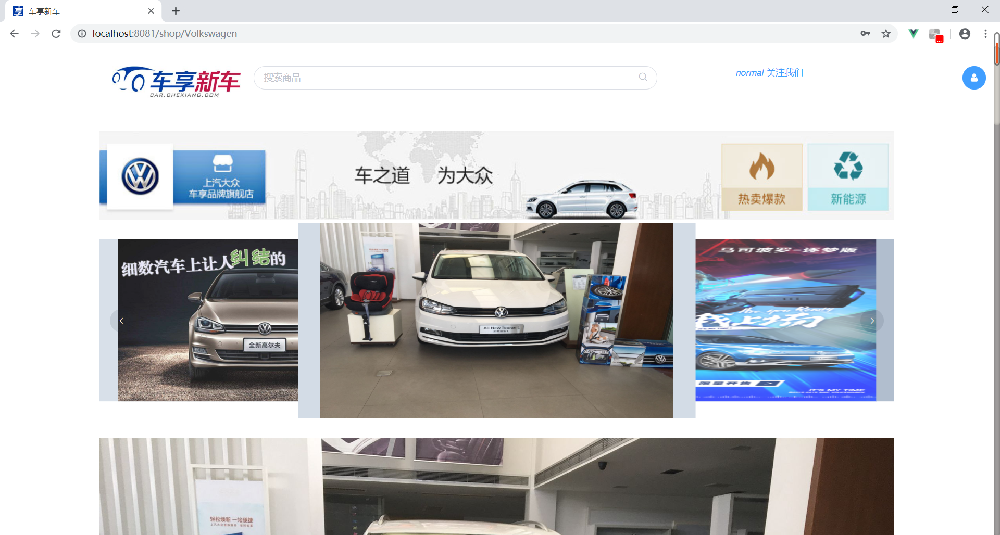

[For English User](./README.md)

# 前端
前端是采用vue.js框架与ElemeUI写的

---

## 前序准备
你需要在本地安装 node 和 git。本项目技术栈基于 ES2015+、vue、vuex、vue-router 、axios 和 element-ui,提前了解和学习这些知识会对使用本项目有很大的帮助。

## 目录结构
本项目差不多算一个完整的开发框架，提供了涵盖中后台开发的各类功能，下面是整个项目的目录结构
```text
├── build                      // 构建相关
├── config                     // 配置相关
├── src                        // 源代码
│   ├── api                    // 所有请求
│   ├── assets                 // 主题 字体等静态资源
│   ├── components             // 全局公用组件
│   ├── directive              // 全局指令
│   ├── filters                // 全局 filter
│   ├── icons                  // 项目所有 svg icons
│   ├── mock                   // 项目mock 模拟数据
│   ├── router                 // 路由
│   ├── store                  // 全局 store管理
│   ├── styles                 // 全局样式
│   ├── utils                  // 全局公用方法
│   ├── views                  // views 所有页面
│   ├── App.vue                // 入口页面
│   ├── main.js                // 入口文件 加载组件 初始化等
│   └── permission.js          // 网页入口初始化路由
├── static                     // 第三方不打包资源
├── .babelrc                   // babel-loader 配置
├── .eslintrc.js               // eslint 配置项
├── .gitignore                 // git 忽略项
├── .travis.yml                // 自动化CI配置
├── favicon.ico                // favicon图标
├── index.html                 // html模板
└── package.json               // package.json
```
## 开发
```text
# clone the project
git clone -b browser https://github.com/lipese/CarShop.git

# install dependency
npm install

# develop
npm run dev
```
浏览器访问[http://localhost:8080](http://localhost:8080).

## 截图

#### 主页




#### 搜索


#### 登录



#### 注册



#### 在线聊天


#### 购物车



#### 我的订单



#### 我的信息


#### 店铺



#### 汽车信息


#### 订单信息


## 许可证
[MIT](./LICENSE)  
Copyright (c) 2017-present lipese
